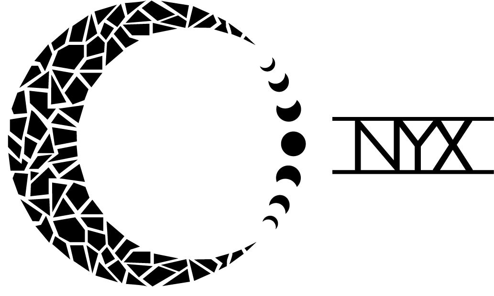

# Nyx

Nyx is a real-time, high-performance 3D rendering engine written in C++ and OpenGL, with an integrated scene editor.

Nyx was built from scratch with the guidance of [@TheCherno](https://github.com/TheCherno) and is partially based on his Hazel Engine.

## Features

- **Physically based rendering** — metallic/roughness PBR pipeline with image-based lighting, including runtime irradiance map generation and equirectangular-to-cubemap conversion via compute shaders
- **Scene system** — entity-component scene representation built on [EnTT](https://github.com/skypjack/entt), with YAML scene serialization and deserialization
- **Editor** — ImGui-based editor application with viewport, scene hierarchy, and object inspector panels
- **Object selection outlines** — jump flood algorithm for pixel-accurate selection outlines
- **Mesh loading** — glTF and other common formats via Assimp
- **Materials and shaders** — material system with runtime shader compilation (shaderc), skybox, glass, and post-process composite passes
- **Core systems** — event system, input handling, layer stack, logging (spdlog), and math utilities (rays, AABBs, triangle intersection)

## Building

Nyx currently targets Windows and Visual Studio.

```
git clone --recursive https://github.com/JacobHensley/Nyx
cd Nyx
buildscripts\PremakeVS19.bat
```

Then open `Nyx.sln` and build. Project files are generated with [Premake](https://premake.github.io/); scripts are provided for VS 2017 and VS 2019.

## Dependencies

All dependencies are vendored in the repository: GLFW, Glad, glm, ImGui, EnTT, Assimp, shaderc, spdlog, stb_image, and yaml-cpp.
